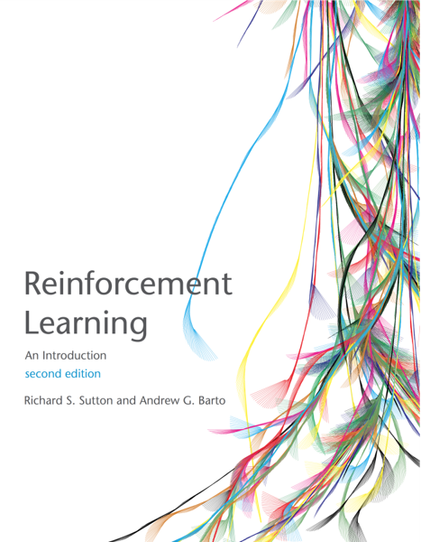

# multiRL <a href="https://yuki-961004.github.io/multiRL/"></a>

<!-- badges: start -->
[](https://github.com/yuki-961004/multiRL/actions/workflows/R-CMD-check.yaml)
[](https://app.codecov.io/gh/yuki-961004/multiRL)
<!-- badges: end -->

## Overview

This package is designed to help users build the **Rescorla-Wagner Model** for **Multi-Armed Bandit** tasks (for TAFC see [binaryRL](https://yuki-961004.github.io/binaryRL/)). Beginners can define models using simple **`if-else`** logic, making model construction more accessible.  

* [Step 1](./articles/multiRL.html#id_1-run-model): Build Reinforcement Learning Models `run_m()`
* [Step 2](./articles/multiRL.html#id_2-recovery): Parameter and Model Recovery `rcv_d()`
* [Step 3](./articles/multiRL.html#id_3-fit-real-data): Fit Real Data `fit_p()`
* [Step 4](./articles/multiRL.html#id_4-replay-the-experiment): Replay the Experiment `rpl_e()`

<!---------------------------------------------------------->

## Installation

```r
# Install the latest version from GitHub
remotes::install_github("yuki-961004/multiRL@*release")
# Load package
library(multiRL)
```

## Features
1. Designed for Multi-Armed Bandit Tasks (see Sutton & Barto, [2018](https://mitpress.mit.edu/9780262039246/reinforcement-learning/)).  
2. Includes three basic models (Niv et al., [2012](https://doi.org/10.1523/JNEUROSCI.5498-10.2012))
3. Follows the ten simple rules (Wilson & Collins [2019](https://doi.org/10.7554/eLife.49547))

<p align="center">
    
    
    <span style="display:inline-block; width:20px;"></span>
    
</p>

## Upgrades

```r
# learning-rate 
binaryRL::func_eta              ->             multiRL::func_alpha
# soft-max  
binaryRL::func_tau              ->             multiRL::func_beta
# utility function
binaryRL::func_gamma            ->             multiRL::func_gamma
# upper-confidence-bound
binaryRL::func_pi               ->             multiRL::func_delta
# ε-(first, greedy, decrasing)  
binaryRL::func_epsilon          ->             multiRL::func_epsilon
```

### Latent Learning Rules 

```r
multiRL::run_m(
  ...,
  behrule = c(
    cue = c(...),
    rsp = c(...)
  )
  ...
)
```

**Reference**  
- Eckstein, M. K., & Collins, A. G. (2020). Computational evidence for hierarchically structured reinforcement learning in humans. Proceedings of the National Academy of Sciences, 117(47), 29381-29389. https://doi.org/10.1073/pnas.1912330117

### Working-Memory System 

```r
# multiRL::func_zeta()

if (reward == 0) {
  decay <- values + zeta * (value0 - values)
} else if (reward < 0) {
  decay <- values + zeta * (value0 - values) + bonus
} else if (reward > 0) {
  decay <- values + zeta * (value0 - values) - bonus
}
```
**Reference**  
- Collins, A. G., & Frank, M. J. (2012). How much of reinforcement learning is working memory, not reinforcement learning? A behavioral, computational, and neurogenetic analysis. European Journal of Neuroscience, 35(7), 1024-1035. https://doi.org/10.1111/j.1460-9568.2011.07980.x  
- Hitchcock, P. F., Kim, J., & Frank, M. J. (2025). How working memory and reinforcement learning interact when avoiding punishment and pursuing reward concurrently. Journal of Experimental Psychology: General. https://psycnet.apa.org/doi/10.1037/xge0001817
