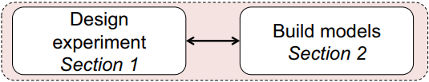
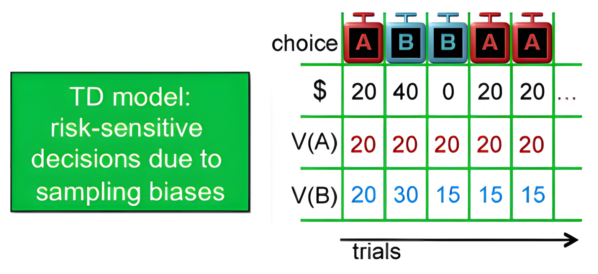
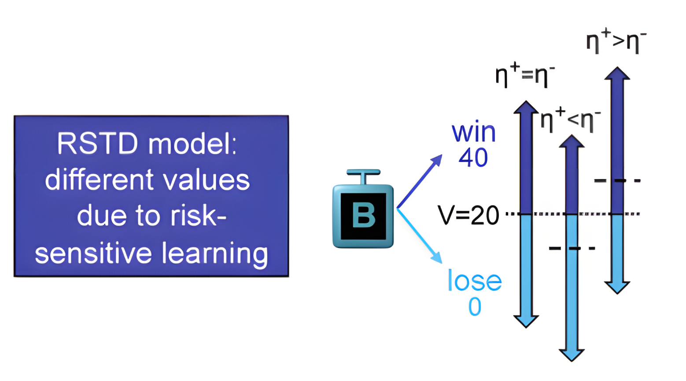
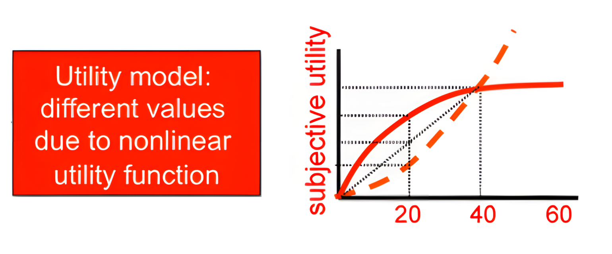
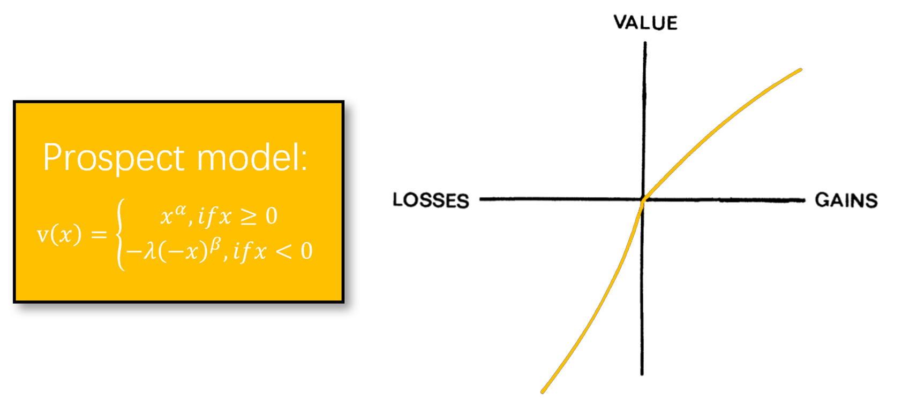

<p align="center">
    
</p>

```{r}
data <- multiRL::TAB
behrule = list(
  cue = c("A", "B", "C", "D"),
  rsp = c("A", "B", "C", "D")
)
colnames = list(
  subid = "Subject", block = "Block", trial = "Trial",
  object = c("L_choice", "R_choice"), 
  reward = c("L_reward", "R_reward"),
  action = "Sub_Choose",
  exinfo = c("Frame", "NetWorth", "RT")
)
```

## TD

<p align="center">
    
</p>

```{r}
multiRL.model <- multiRL::run_m(
  #engine = "R",
  data = data[data[, "Subject"] == 2, ],
  behrule = behrule,
  colnames = colnames,
  params = list(
    free = list(
      alpha = 0.5,
      beta = 0.01,
      delta = 0,
      sticky = 40,
      reset = NA_real_
    )
  ),
  priors = list(
    alpha = function(x) {stats::dbeta(x, shape1 = 2, shape2 = 2, log = TRUE)}, 
    beta = function(x) {stats::dexp(x, rate = 1, log = TRUE)}
  ),
  settings = list(name = "TD", policy = "on")
)

multiRL.summary <- multiRL::summary(multiRL.model)
```

## RSTD

<p align="center">
    
</p>

```{r}
multiRL.model <- multiRL::run_m(
  data = data[data[, "Subject"] == 1, ],
  behrule = behrule,
  colnames = colnames,
  params = list(
    free = list(
      alphaN = 0.3,
      alphaP = 0.7,
      beta = 0.5
    )
  ),
  priors = list(
    alphaN = function(x) {stats::dbeta(x, shape1 = 2, shape2 = 2, log = TRUE)}, 
    alphaP = function(x) {stats::dbeta(x, shape1 = 2, shape2 = 2, log = TRUE)}, 
    beta = function(x) {stats::dexp(x, rate = 1, log = TRUE)}
  ),
  settings = list(name = "RSTD", policy = "on")
)

multiRL.summary <- multiRL::summary(multiRL.model)
```

## Utility

<p align="center">
    
</p>

```{r}
multiRL.model <- multiRL::run_m(
  data = data[data[, "Subject"] == 1, ],
  behrule = behrule,
  colnames = colnames,
  params = list(
    free = list(
      alpha = 0.5,
      beta = 0.5,
      gamma = 0.5
    )
  ),
  priors = list(
    alpha = function(x) {stats::dbeta(x, shape1 = 2, shape2 = 2, log = TRUE)}, 
    beta = function(x) {stats::dexp(x, rate = 1, log = TRUE)},
    gamma = function(x) {stats::dbeta(x, shape1 = 2, shape2 = 2, log = TRUE)}
  ),
  settings = list(name = "Utility", policy = "on")
)

multiRL.summary <- multiRL::summary(multiRL.model)
```

## Prospect

<p align="center">
    
</p>

Below, I will implement a new `func_gamma` to ensure compatibility with both Stevens' Power Law and Prospect Theory.

```{r}
my_func_gamma <- function(
    shown,
    reward,
    params,
    ...
){
  # `get_param` is an internal function and must be accessed using `:::`
  lambda    <-  params[["lambda"]]
  gamma     <-  params[["gamma"]]
  gammaN    <-  params[["gammaN"]]
  gammaP    <-  params[["gammaP"]]
  
  if (
    gamma != 1 && is.na(gammaN) && is.na(gammaP)
  ) {
    model <- "Utility"
  } else if (
    gamma == 1 && !(is.na(gammaN)) && !(is.na(gammaP))
  ) {
    model <- "Prospect"
  } else {
    stop("Unknown Model! Plase modify your utility function")
  }
  
  # Stevens's Power Law
  if (model == "Utility") {
    utility <- sign(reward) * (abs(reward) ^ gamma)
  }
  # Prospect Theory
  else if (model == "Prospect" && reward < 0) {
    utility <- lambda * sign(reward) * (abs(reward) ^ gammaN)
  }
  else if (model == "Prospect" && reward >= 0) {
    utility <- sign(reward) * (abs(reward) ^ gammaP)
  }
  
  return(utility)
}
```

```{r}
multiRL.model <- multiRL::run_m(
  data = data[data[, "Subject"] == 1, ],
  behrule = behrule,
  colnames = colnames,
  params = list(
    free = list(
      alpha = 0.5,
      beta = 0.5,
      lambda = 1.5,
      gammaN = 0.7,
      gammaP = 0.3
    )
  ),
  priors = list(
    alpha = function(x) {stats::dbeta(x, shape1 = 2, shape2 = 2, log = TRUE)}, 
    beta = function(x) {stats::dexp(x, rate = 1, log = TRUE)},
    lambda = function(x) {stats::dnorm(x, mean = 2, sd = 0.3, log = TRUE)},
    gammaN = function(x) {stats::dbeta(x, shape1 = 2, shape2 = 2, log = TRUE)},
    gammaP = function(x) {stats::dbeta(x, shape1 = 2, shape2 = 2, log = TRUE)}
  ),
  funcs = list(
    # Other unmodified `funcs` will use the built-in functions.
    util_func = my_func_gamma
  ),
  settings = list(name = "Prospect", policy = "on")
)

multiRL.summary <- multiRL::summary(multiRL.model)
```

