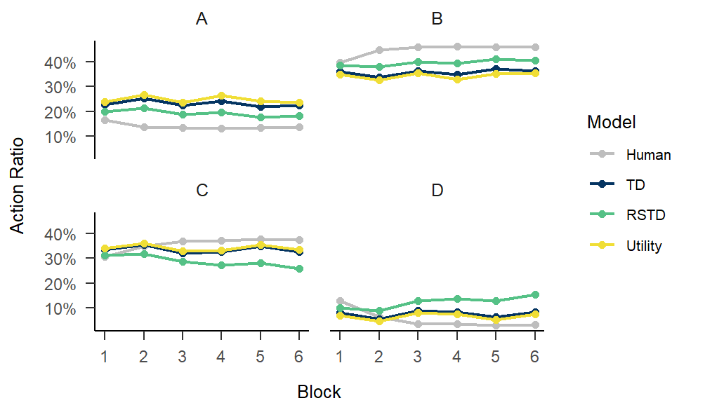
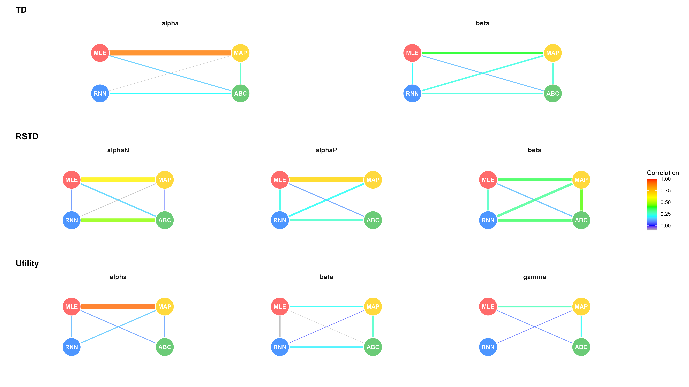

<p align="center">
    
</p>

## Estimate Methods

With minimal configuration, users can estimate optimal parameters using four distinct methods. In the following code snippets, I only highlight the `arguments` that vary by estimation method. Unless explicitly noted, other arguments can be duplicated from the above example.

```{r eval=FALSE}
# How to use MLE as estimate method
fitting.MLE <- multiRL::fit_p(
  estimate = "MLE",
  control = list(
    core = 10, sample = 100, iter = 100
  ),
  ...
)
# How to use MAP as estimate method
fitting.MAP <- multiRL::fit_p(
  estimate = "MAP",
  control = list(
    core = 10, sample = 100, iter = 100,
    diff = 0.001, patience = 10
  ),
  ...
)
# How to use ABC as estimate method
fitting.ABC <- multiRL::fit_p(
  estimate = "ABC",
  control = list(
    core = 10, sample = 100, train = 1000,
    tol = 0.1
  ),
  ...
)

# How to use RNN as estimate method
reticulate::use_condaenv(condaenv = "your_tensorflow_env_name", required = TRUE)

fitting.RNN <- multiRL::fit_p(
  estimate = "RNN",
  control = list(
    core = 1, sample = 100, train = 1000,
    layer = "GRU", units = 128, batch_size = 10, epochs = 100
  ),
  ...
)
```

**Note**  
All of the following figures were generated using `multiRL::rpl_e()`

## Demo

### MLE

```{r eval=FALSE}
fitting.MLE <- multiRL::fit_p(
  estimate = "MLE",

  data = data,
  behrule = behrule,
  colnames = colnames,

  models = list(multiRL::TD, multiRL::RSTD, multiRL::Utility),
  settings = list(name = c("TD", "RSTD", "Utility")),
  
  algorithm = "NLOPT_GN_MLSL",
  lowers = list(c(0, 0), c(0, 0, 0), c(0, 0, 0)),
  uppers = list(c(1, 10), c(1, 1, 10), c(1, 10, 1)),
  control = list(core = 10, iter = 100)
)

save(fitting.MLE, file = "./fitting.MLE.Rdata")
```  

<p align="center">
    
</p>

### MAP

```{r eval=FALSE}
fitting.MAP <- multiRL::fit_p(
  estimate = "MAP",

  data = data,
  behrule = behrule,
  colnames = colnames,

  models = list(multiRL::TD, multiRL::RSTD, multiRL::Utility),
  priors = list(
    list(
      alpha = function(x) {stats::dbeta(x, shape1 = 2, shape2 = 2, log = TRUE)}, 
      beta = function(x) {stats::dexp(x, rate = 1, log = TRUE)}
    ),
    list(
      alphaN = function(x) {stats::dbeta(x, shape1 = 2, shape2 = 2, log = TRUE)}, 
      alphaP = function(x) {stats::dbeta(x, shape1 = 2, shape2 = 2, log = TRUE)}, 
      beta = function(x) {stats::dexp(x, rate = 1, log = TRUE)}
    ),
    list(
      alpha = function(x) {stats::dbeta(x, shape1 = 2, shape2 = 2, log = TRUE)}, 
      beta = function(x) {stats::dexp(x, rate = 1, log = TRUE)},
      gamma = function(x) {stats::dbeta(x, shape1 = 2, shape2 = 2, log = TRUE)}
    )
  ),
  settings = list(name = c("TD", "RSTD", "Utility")),
  
  algorithm = "NLOPT_GN_MLSL",
  lowers = list(c(0, 0), c(0, 0, 0), c(0, 0, 0)),
  uppers = list(c(1, 10), c(1, 1, 10), c(1, 10, 1)),
  control = list(
    core = 10, iter = 100,
    diff = 0.1, patience = 1
  )
)

save(fitting.MAP, file = "./fitting.MAP.Rdata")
```  

<p align="center">
    
</p>

### ABC

```{r eval=FALSE}
fitting.ABC <- multiRL::fit_p(
  estimate = "ABC",

  data = data,
  behrule = behrule,
  colnames = colnames,

  models = list(multiRL::TD, multiRL::RSTD, multiRL::Utility),
  priors = list(
    list(
      alpha = function(x) {stats::rbeta(n = 1, shape1 = 2, shape2 = 2)}, 
      beta = function(x) {stats::rexp(n = 1, rate = 1)}
    ),
    list(
      alphaN = function(x) {stats::rbeta(n = 1, shape1 = 2, shape2 = 2)}, 
      alphaP = function(x) {stats::rbeta(n = 1, shape1 = 2, shape2 = 2)}, 
      beta = function(x) {stats::rexp(n = 1, rate = 1)}
    ),
    list(
      alpha = function(x) {stats::rbeta(n = 1, shape1 = 2, shape2 = 2)}, 
      beta = function(x) {stats::rexp(n = 1, rate = 1)},
      gamma = function(x) {stats::rbeta(n = 1, shape1 = 2, shape2 = 2)}
    )
  ),
  settings = list(name = c("TD", "RSTD", "Utility")),
  
  lowers = list(c(0, 0), c(0, 0, 0), c(0, 0, 0)),
  uppers = list(c(1, 10), c(1, 1, 10), c(1, 10, 1)),
  control = list(
    core = 10, train = 1000,
    tol = 0.1
  )
)

save(fitting.ABC, file = "./fitting.ABC.Rdata")
```  

<p align="center">
    
</p>

### RNN

```{r eval=FALSE}
reticulate::use_condaenv(condaenv = "tf-gpu", required = TRUE)

#> Show in New Window
#> -------------------------------------------------------------------
#> reticulate::use_condaenv(condaenv = "tensorflow", required = TRUE)
#> -------------------------------------------------------------------
#> 
#> Please confirm you have loaded TensorFlow into R (enter 1 or 2). 
#> 
#> 1: Yes, it is loaded
#> 2: No, it is not loaded

fitting.RNN <- multiRL::fit_p(
  estimate = "RNN",

  data = data,
  behrule = behrule,
  colnames = colnames,

  models = list(multiRL::TD, multiRL::RSTD, multiRL::Utility),
  priors = list(
    list(
      alpha = function(x) {stats::rbeta(n = 1, shape1 = 2, shape2 = 2)}, 
      beta = function(x) {stats::rexp(n = 1, rate = 1)}
    ),
    list(
      alphaN = function(x) {stats::rbeta(n = 1, shape1 = 2, shape2 = 2)}, 
      alphaP = function(x) {stats::rbeta(n = 1, shape1 = 2, shape2 = 2)}, 
      beta = function(x) {stats::rexp(n = 1, rate = 1)}
    ),
    list(
      alpha = function(x) {stats::rbeta(n = 1, shape1 = 2, shape2 = 2)}, 
      beta = function(x) {stats::rexp(n = 1, rate = 1)},
      gamma = function(x) {stats::rbeta(n = 1, shape1 = 2, shape2 = 2)}
    )
  ),
  settings = list(name = c("TD", "RSTD", "Utility")),
  
  lowers = list(c(0, 0), c(0, 0, 0), c(0, 0, 0)),
  uppers = list(c(1, 10), c(1, 1, 10), c(1, 10, 1)),
  control = list(
    core = 1, train = 1000,
    layer = "GRU", units = 128, batch_size = 10, epochs = 100
  )
)

save(fitting.RNN, file = "./fitting.RNN.Rdata")
```

<p align="center">
    
</p>

## Comparison

Despite employing identical computational models with synchronized hyper-parameter settings (e.g., a fixed lapse rate of 0.1), the resulting parameter estimates exhibit substantial discrepancies across different estimation methods. Remarkably, all four estimation techniques had previously demonstrated robust parameter recovery capabilities in simulated environments.  

As illustrated in the figure below, the probability density functions (PDFs) of the "optimal" parameters vary significantly by method. For instance, MLE and MAP tend to yield estimates clustered around extreme boundaries (near 0 or 1). 

```{r eval=FALSE, include = FALSE}
df_mle <- dplyr::bind_rows(unclass(fitting.MLE)) |>
  dplyr::mutate(Estimate = "MLE")

df_map <- dplyr::bind_rows(unclass(fitting.MAP)) |>
  dplyr::mutate(Estimate = "MAP")

df_abc <- dplyr::bind_rows(unclass(fitting.ABC)) |>
  dplyr::mutate(Estimate = "ABC")

df_rnn <- dplyr::bind_rows(unclass(fitting.RNN)) |>
  dplyr::mutate(Estimate = "RNN")

df <- dplyr::bind_rows(df_mle, df_map, df_abc, df_rnn) |>
  tidyr::pivot_longer(
    cols = c(alpha, beta, alphaN, alphaP, gamma),
    names_to = "parameter",
    values_to = "value"
  ) |>
  dplyr::filter(!is.na(value)) |>
  dplyr::mutate(
    facet_tag = paste(fit_model, parameter, sep = "_"),
    facet_tag = factor(
      paste0(fit_model, "(", parameter, ")"),
      levels = c(
        "TD(alpha)", "TD(beta)", "RSTD(alphaN)", "RSTD(alphaP)", 
        "RSTD(beta)", "Utility(alpha)", "Utility(beta)", "Utility(gamma)"
      )
    ),
    Estimate = factor(Estimate, levels = c("MLE", "MAP", "ABC", "RNN"))
  ) |>
  ggplot2::ggplot(
    ggplot2::aes(x = value, fill = Estimate, color = Estimate)
  ) +
  ggplot2::geom_density(alpha = 0.4) +
  ggplot2::facet_wrap(
    ggplot2::vars(facet_tag, Estimate), 
    scales = "free", 
    ncol = 4
  ) +
  ggplot2::scale_fill_manual(
    values = c(
      "MLE" = "#ff6b6b", "MAP" = "#ffd93d", "ABC" = "#6bcb77", "RNN" = "#4d96ff"
    )
  ) +
  ggplot2::scale_color_manual(
    values = c(
      "MLE" = "#ff6b6b", "MAP" = "#ffd93d", "ABC" = "#6bcb77", "RNN" = "#4d96ff"
    )
  ) +
  papaja::theme_apa() +
  ggplot2::labs(x = "Optimal Values", y = "Density")

ggplot2::ggsave(
  filename = "./fig/Estimation_Comparison(PDF).png", 
  width = 32, height = 18
)
```

<p align="center">
    
</p>

Furthermore, when examining the pairwise correlations between the optimal parameters, the convergence remains strikingly low. Only the MLE and MAP estimates for $\alpha$ show a moderate-to-high correlation, whereas almost no meaningful associations exist between other pairs of estimation techniques.

```{r eval=FALSE, include = FALSE}
df <- dplyr::bind_rows(df_mle, df_map, df_abc, df_rnn)

model_params <- list(
  TD = c("alpha", "beta"),
  RSTD = c("alphaN", "alphaP", "beta"),
  Utility = c("alpha", "beta", "gamma")
)

estimate_pairs <- list(
  c("MLE", "MAP"), c("MLE", "ABC"), c("MLE", "RNN"),
  c("MAP", "ABC"), c("MAP", "RNN"),
  c("ABC", "RNN")
)

nodes <- data.frame(
  method = c("MLE", "MAP", "ABC", "RNN"),
  x = c(0.25, 0.75, 0.75, 0.25),
  y = c(0.75, 0.75, 0.25, 0.25)
)

calc_cor <- function(data, m, p, meth1, meth2) {
  v1 <- dplyr::filter(data, fit_model == m & Estimate == meth1)[[p]]
  v2 <- dplyr::filter(data, fit_model == m & Estimate == meth2)[[p]]
  
  return(stats::cor(v1, v2, use = "complete.obs"))
}

plot_data <- purrr::map_df(names(model_params), function(m) {
  purrr::map_df(model_params[[m]], function(p) {
    purrr::map_df(estimate_pairs, function(pair) {
      data.frame(
        model = m,
        estimate1 = pair[1],
        estimate2 = pair[2],
        parameter = p,
        cor = calc_cor(df, m, p, pair[1], pair[2])
      )
    })
  })
}) |>
  dplyr::left_join(nodes, by = stats::setNames("method", "estimate1")) |>
  dplyr::rename(x1 = x, y1 = y) |>
  dplyr::left_join(nodes, by = stats::setNames("method", "estimate2")) |>
  dplyr::rename(x2 = x, y2 = y) |>
  dplyr::mutate(
    cor_color = base::ifelse(cor < 0, -0.1, cor),
    model = factor(model, levels = c("TD", "RSTD", "Utility"))
  )
```

```{r eval=FALSE, include = FALSE}
draw_network <- function(data_subset, nodes_data, title_text) {
  ggplot2::ggplot(data_subset) +
    ggplot2::geom_segment(
      ggplot2::aes(
        x = x1, y = y1, xend = x2, yend = y2, 
        linewidth = base::abs(cor), color = cor_color
      ),
      alpha = 0.8
    ) +
    ggplot2::geom_point(
      data = nodes_data, 
      ggplot2::aes(x = x, y = y, fill = method), 
      size = 14, color = "white", shape = 21, stroke = 1
    ) +
    ggplot2::geom_text(
      data = nodes_data, 
      ggplot2::aes(x = x, y = y, label = method),
      size = 3.5, fontface = "bold", color = "white"
    ) +
    ggplot2::facet_wrap(~ parameter, ncol = 3) +
    ggplot2::scale_y_continuous(limits = c(0, 1)) +
    ggplot2::scale_x_continuous(limits = c(0, 1)) +
    # 统一主题设置
    ggplot2::theme(
      panel.background = ggplot2::element_rect(fill = "white", color = NA),
      plot.background = ggplot2::element_rect(fill = "white", color = NA),
      axis.text = ggplot2::element_blank(),
      axis.ticks = ggplot2::element_blank(),
      strip.background = ggplot2::element_blank(),
      strip.text = ggplot2::element_text(face = "bold", size = 11),
      plot.title = ggplot2::element_text(hjust = 0, face = "bold", size = 14)
    ) +
    ggplot2::labs(title = title_text, x = "", y = "")
}

# 基础预处理
plot_base <- plot_data |> 
  dplyr::mutate(cor_color = base::ifelse(cor < 0, -0.1, cor))

# 生成三张独立的图
p1 <- plot_base |> 
  dplyr::filter(model == "TD") |> 
  draw_network(nodes, "TD")

p2 <- plot_base |> 
  dplyr::filter(model == "RSTD") |> 
  draw_network(nodes, "RSTD")

p3 <- plot_base |> 
  dplyr::filter(model == "Utility") |> 
  draw_network(nodes, "Utility")

library(patchwork)

final_plot <- (p1 / p2 / p3) + 
  patchwork::plot_layout(
    heights = base::c(1, 1, 1), 
    guides = "collect"          
  ) & 
  ggplot2::scale_color_gradientn(
    colors = base::c("grey70", "blue", "cyan", "green", "yellow", "orange", "red"),
    values = scales::rescale(c(-0.1, 0, 0.2, 0.4, 0.6, 0.8, 1)),
    limits = c(-0.1, 1),
    name = "Correlation"
  ) &
  ggplot2::scale_fill_manual(
    values = c(
      "MLE" = "#ff6b6b", "MAP" = "#ffd93d", "ABC" = "#6bcb77", "RNN" = "#4d96ff"
    ),
    guide = "none"
  ) &
  ggplot2::scale_linewidth(range = c(0.2, 4), guide = "none")

ggplot2::ggsave(
  filename = "./fig/Estimation_Comparison(NET).png", 
  width = 16, height = 9
)
```

<p align="center">
    
</p>
