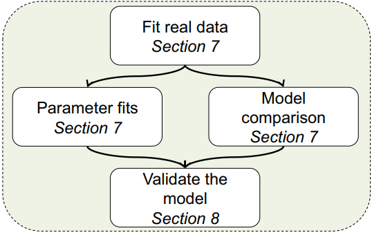

<p align="center">
    
</p>

```{r eval=FALSE}
fitting.MLE <- multiRL::fit_p(
  estimate = "MLE",

  data = multiRL::TAB,
  colnames = list(
    object = c("L_choice", "R_choice"), 
    reward = c("L_reward", "R_reward"),
    action = "Sub_Choose"
  ),
  behrule = list(
    cue = c("A", "B", "C", "D"),
    rsp = c("A", "B", "C", "D")
  ),

  models = list(
    multiRL::TD, 
    multiRL::RSTD, 
    multiRL::Utility
  ),
  settings = list(
    list(name = "TD"), 
    list(name = "RSTD"), 
    list(name = "Utility")
  ),
  
  algorithm = c("NLOPT_GN_MLSL", "NLOPT_LN_BOBYQA"),
  lowers = list(c(0, 0), c(0, 0, 0), c(0, 0, 0)),
  uppers = list(c(1, 5), c(1, 1, 5), c(1, 5, 1)),
  control = list(core = 10, iter = 100)
)

save(fitting.MLE, file = "./fitting.MLE.Rdata")
```  
