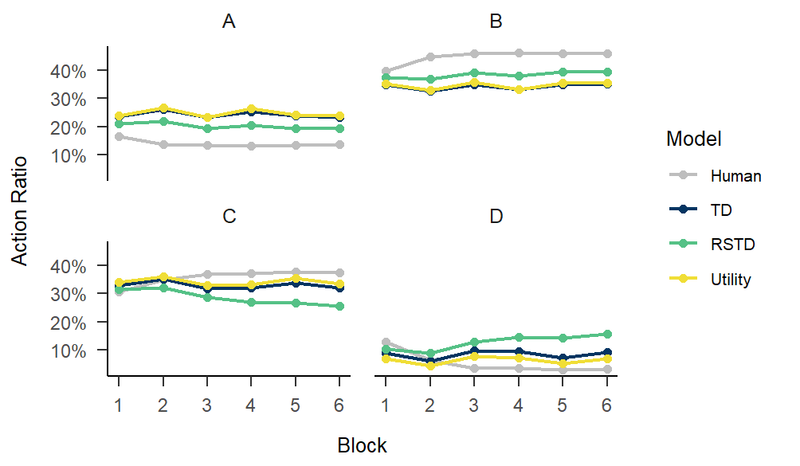
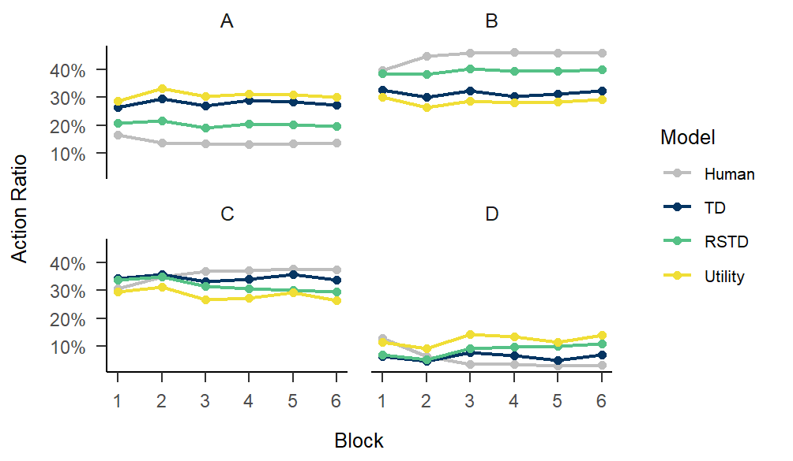
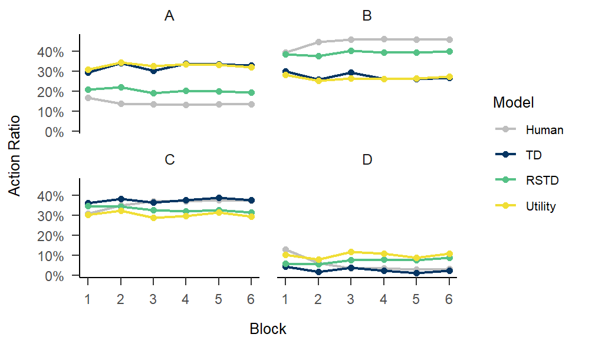

<p align="center">
    
</p>

## Estimate Methods

With minimal configuration, users can estimate optimal parameters using four distinct methods. In the following code snippets, I only highlight the `arguments` that vary by estimation method. Unless explicitly noted, other arguments can be duplicated from the above example.

```{r eval=FALSE}
# How to use MLE as estimate method
fitting.MLE <- multiRL::fit_p(
  estimate = "MLE",
  control = list(
    core = 10, sample = 100, iter = 100
  ),
  ...
)
# How to use MAP as estimate method
fitting.MAP <- multiRL::fit_p(
  estimate = "MAP",
  control = list(
    core = 10, sample = 100, iter = 100,
    diff = 0.001, patience = 10
  ),
  ...
)
# How to use ABC as estimate method
fitting.ABC <- multiRL::fit_p(
  estimate = "ABC",
  control = list(
    core = 10, sample = 100, train = 1000,
    tol = 0.1
  ),
  ...
)

# How to use RNN as estimate method
reticulate::use_condaenv(condaenv = "your_tensorflow_env_name", required = TRUE)

fitting.RNN <- multiRL::fit_p(
  estimate = "RNN",
  control = list(
    core = 1, sample = 100, train = 1000,
    layer = "GRU", units = 128, batch_size = 10, epochs = 100
  ),
  ...
)
```

**Note**  
All of the following figures were generated using `multiRL::rpl_e()`

## Demo

### MLE

```{r eval=FALSE}
fitting.MLE <- multiRL::fit_p(
  estimate = "MLE",

  data = data,
  behrule = behrule,
  colnames = colnames,

  models = list(multiRL::TD, multiRL::RSTD, multiRL::Utility),
  settings = list(name = c("TD", "RSTD", "Utility")),
  
  algorithm = "NLOPT_GN_MLSL",
  lowers = list(c(0, 0), c(0, 0, 0), c(0, 0, 0)),
  uppers = list(c(1, 10), c(1, 1, 10), c(1, 10, 1)),
  control = list(core = 10, iter = 100)
)

save(fitting.MLE, file = "./fitting.MLE.Rdata")
```  

<p align="center">
    
</p>

### MAP

```{r eval=FALSE}
fitting.MAP <- multiRL::fit_p(
  estimate = "MAP",

  data = data,
  behrule = behrule,
  colnames = colnames,

  models = list(multiRL::TD, multiRL::RSTD, multiRL::Utility),
  priors = list(
    list(
      alpha = function(x) {stats::dbeta(x, shape1 = 2, shape2 = 2, log = TRUE)}, 
      beta = function(x) {stats::dexp(x, rate = 1, log = TRUE)}
    ),
    list(
      alphaN = function(x) {stats::dbeta(x, shape1 = 2, shape2 = 2, log = TRUE)}, 
      alphaP = function(x) {stats::dbeta(x, shape1 = 2, shape2 = 2, log = TRUE)}, 
      beta = function(x) {stats::dexp(x, rate = 1, log = TRUE)}
    ),
    list(
      alpha = function(x) {stats::dbeta(x, shape1 = 2, shape2 = 2, log = TRUE)}, 
      beta = function(x) {stats::dexp(x, rate = 1, log = TRUE)},
      gamma = function(x) {stats::dbeta(x, shape1 = 2, shape2 = 2, log = TRUE)}
    )
  ),
  settings = list(name = c("TD", "RSTD", "Utility")),
  
  algorithm = "NLOPT_GN_MLSL",
  lowers = list(c(0, 0), c(0, 0, 0), c(0, 0, 0)),
  uppers = list(c(1, 10), c(1, 1, 10), c(1, 10, 1)),
  control = list(
    core = 10, sample = 100, iter = 100,
    diff = 0.1, patience = 10
  )
)

save(fitting.MAP, file = "./fitting.MAP.Rdata")
```  

<p align="center">
    
</p>

### ABC

```{r eval=FALSE}
fitting.ABC <- multiRL::fit_p(
  estimate = "ABC",

  data = data,
  behrule = behrule,
  colnames = colnames,

  models = list(multiRL::TD, multiRL::RSTD, multiRL::Utility),
  priors = list(
    list(
      alpha = function(x) {stats::rbeta(n = 1, shape1 = 2, shape2 = 2)}, 
      beta = function(x) {stats::rexp(n = 1, rate = 1)}
    ),
    list(
      alphaN = function(x) {stats::rbeta(n = 1, shape1 = 2, shape2 = 2)}, 
      alphaP = function(x) {stats::rbeta(n = 1, shape1 = 2, shape2 = 2)}, 
      beta = function(x) {stats::rexp(n = 1, rate = 1)}
    ),
    list(
      alpha = function(x) {stats::rbeta(n = 1, shape1 = 2, shape2 = 2)}, 
      beta = function(x) {stats::rexp(n = 1, rate = 1)},
      gamma = function(x) {stats::rbeta(n = 1, shape1 = 2, shape2 = 2)}
    )
  ),
  settings = list(name = c("TD", "RSTD", "Utility")),
  
  lowers = list(c(0, 0), c(0, 0, 0), c(0, 0, 0)),
  uppers = list(c(1, 10), c(1, 1, 10), c(1, 10, 1)),
  control = list(
    core = 10, sample = 100, train = 1000,
    tol = 0.1
  )
)

save(fitting.ABC, file = "./fitting.ABC.Rdata")
```  

<p align="center">
    
</p>

### RNN

```{r eval=FALSE}
reticulate::use_condaenv(condaenv = "tf-gpu", required = TRUE)

#> Show in New Window
#> -------------------------------------------------------------------
#> reticulate::use_condaenv(condaenv = "tensorflow", required = TRUE)
#> -------------------------------------------------------------------
#> 
#> Please confirm you have loaded TensorFlow into R (enter 1 or 2). 
#> 
#> 1: Yes, it is loaded
#> 2: No, it is not loaded

fitting.RNN <- multiRL::fit_p(
  estimate = "RNN",

  data = data,
  behrule = behrule,
  colnames = colnames,

  models = list(multiRL::TD, multiRL::RSTD, multiRL::Utility),
  priors = list(
    list(
      alpha = function(x) {stats::rbeta(n = 1, shape1 = 2, shape2 = 2)}, 
      beta = function(x) {stats::rexp(n = 1, rate = 1)}
    ),
    list(
      alphaN = function(x) {stats::rbeta(n = 1, shape1 = 2, shape2 = 2)}, 
      alphaP = function(x) {stats::rbeta(n = 1, shape1 = 2, shape2 = 2)}, 
      beta = function(x) {stats::rexp(n = 1, rate = 1)}
    ),
    list(
      alpha = function(x) {stats::rbeta(n = 1, shape1 = 2, shape2 = 2)}, 
      beta = function(x) {stats::rexp(n = 1, rate = 1)},
      gamma = function(x) {stats::rbeta(n = 1, shape1 = 2, shape2 = 2)}
    )
  ),
  settings = list(name = c("TD", "RSTD", "Utility")),
  
  lowers = list(c(0, 0), c(0, 0, 0), c(0, 0, 0)),
  uppers = list(c(1, 10), c(1, 1, 10), c(1, 10, 1)),
  control = list(
    core = 1, sample = 100, train = 1000,
    layer = "GRU", units = 128, batch_size = 10, epochs = 100
  )
)

save(fitting.RNN, file = "./fitting.RNN.Rdata")
```

<p align="center">
    
</p>

## Comparison

```{r eval=FALSE, include = FALSE}
df_mle <- dplyr::bind_rows(unclass(fitting.MLE)) |>
  dplyr::mutate(Estimate = "MLE")

df_map <- dplyr::bind_rows(unclass(fitting.MAP)) |>
  dplyr::mutate(Estimate = "MAP")

df_abc <- dplyr::bind_rows(unclass(fitting.ABC)) |>
  dplyr::mutate(Estimate = "ABC")

df_rnn <- dplyr::bind_rows(unclass(fitting.RNN)) |>
  dplyr::mutate(Estimate = "RNN")

df <- dplyr::bind_rows(df_mle, df_map, df_abc, df_rnn) |>
  tidyr::pivot_longer(
    cols = c(alpha, beta, alphaN, alphaP, gamma),
    names_to = "parameter",
    values_to = "value"
  ) |>
  dplyr::filter(!is.na(value)) |>
  dplyr::mutate(
    facet_tag = paste(fit_model, parameter, sep = "_"),
    facet_tag = factor(
      paste0(fit_model, "(", parameter, ")"),
      levels = c(
        "TD(alpha)", "TD(beta)", "RSTD(alphaN)", "RSTD(alphaP)", 
        "RSTD(beta)", "Utility(alpha)", "Utility(beta)", "Utility(gamma)"
      )
    ),
    Estimate = factor(Estimate, levels = c("MLE", "MAP", "ABC", "RNN"))
  ) |>
  ggplot2::ggplot(
    ggplot2::aes(x = value, fill = Estimate, color = Estimate)
  ) +
  ggplot2::geom_density(alpha = 0.4) +
  ggplot2::facet_wrap(
    ggplot2::vars(facet_tag, Estimate), 
    scales = "free", 
    ncol = 4
  ) +
  ggplot2::scale_fill_manual(
    values = c(
      "MLE" = "#ff6b6b", "MAP" = "#ffd93d", "ABC" = "#6bcb77", "RNN" = "#4d96ff"
    )
  ) +
  ggplot2::scale_color_manual(
    values = c(
      "MLE" = "#ff6b6b", "MAP" = "#ffd93d", "ABC" = "#6bcb77", "RNN" = "#4d96ff"
    )
  ) +
  papaja::theme_apa() +
  ggplot2::labs(x = "Optimal Values", y = "Density")

ggplot2::ggsave(
  filename = "./fig/Estimation_Comparison.png", 
  width = 32, height = 18
)
```

<p align="center">
    
</p>
