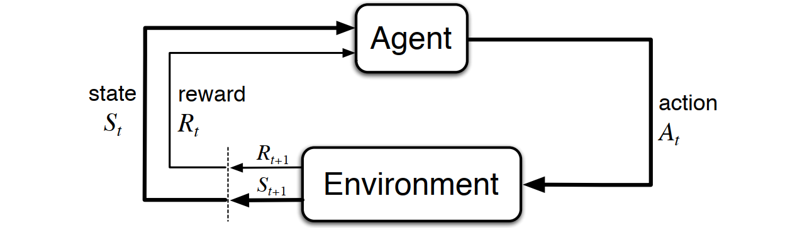

$$
\textbf{Markov Decision Process (MDP)} 
$$

    

$$
\Downarrow 
$$

$$
\textbf{Temporal-Difference TD(λ)} 
$$

$$
V_{\text{new}}(S_t) \leftarrow V_{\text{old}}(S_t) + \eta \cdot \left[ 
G_t^{\lambda} - V_{\text{old}}(S_t) 
\right] 
$$
$$
G_t^{\lambda} = (1-\lambda)\sum_{n=1}^{T-t-1}\lambda^{n-1}G_{t:t+n} + \lambda^{T-t-1}G_t
$$

$$
\Downarrow 
$$

$$
G_t^{\lambda} \xrightarrow{\lambda = 0} 
G_t^{0} = (1-0)\sum_{n=1}^{T-t-1}0^{n-1}G_{t:t+n} + 0^{T-t-1}G_t
$$

$$
\Downarrow 
$$

$$
G_t^{0} = G_{t:t+1}= r_{t+1} + \gamma V_{\text{old}}(S_{t+1})
$$

$$
\Downarrow 
$$

$$
\textbf{Temporal-Difference TD(0)}
$$

$$
V_{\text{new}}(S_t) \leftarrow V_{\text{old}}(S_t) + \eta \cdot \left[ 
r_{t+1} + \gamma V_{\text{old}}(S_{t+1}) - V_{\text{old}}(S_t) 
\right] 
$$
$$
\Downarrow
$$

$$
r_{t+1} + \gamma V_{\text{old}}(S_{t+1})
\quad
\xrightarrow{\gamma = 0}
\quad
r_{t+1}
$$

$$
\Downarrow
$$

$$
\textbf{Rescorla-Wagner Model}
$$

$$
V_{\text{new}}(S_t) \leftarrow V_{\text{old}}(S_t) + \eta \cdot \left[r_{t+1} - V_{\text{old}}(S_t) \right]
$$

