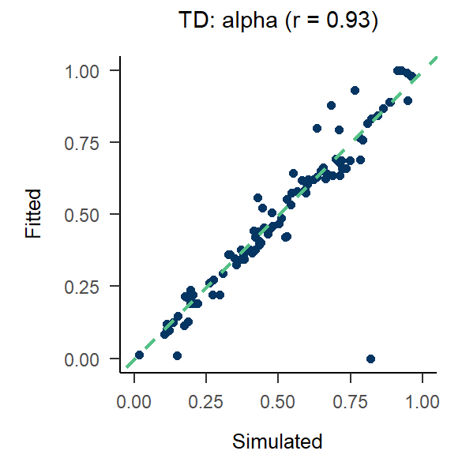
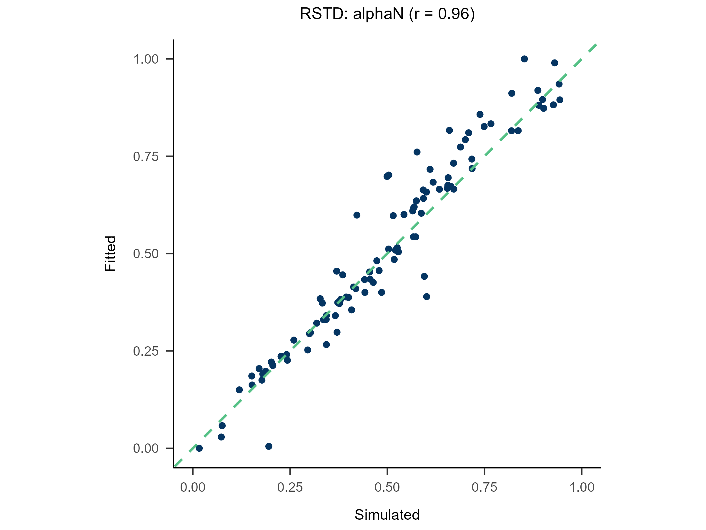
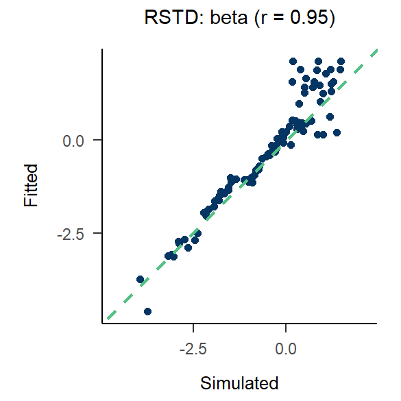
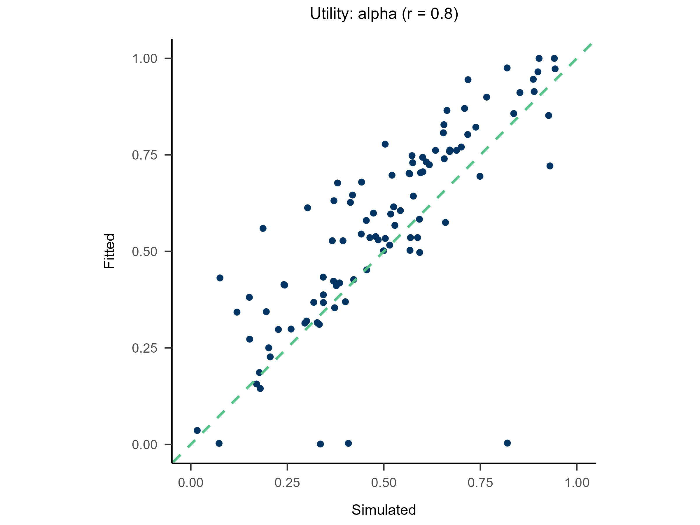
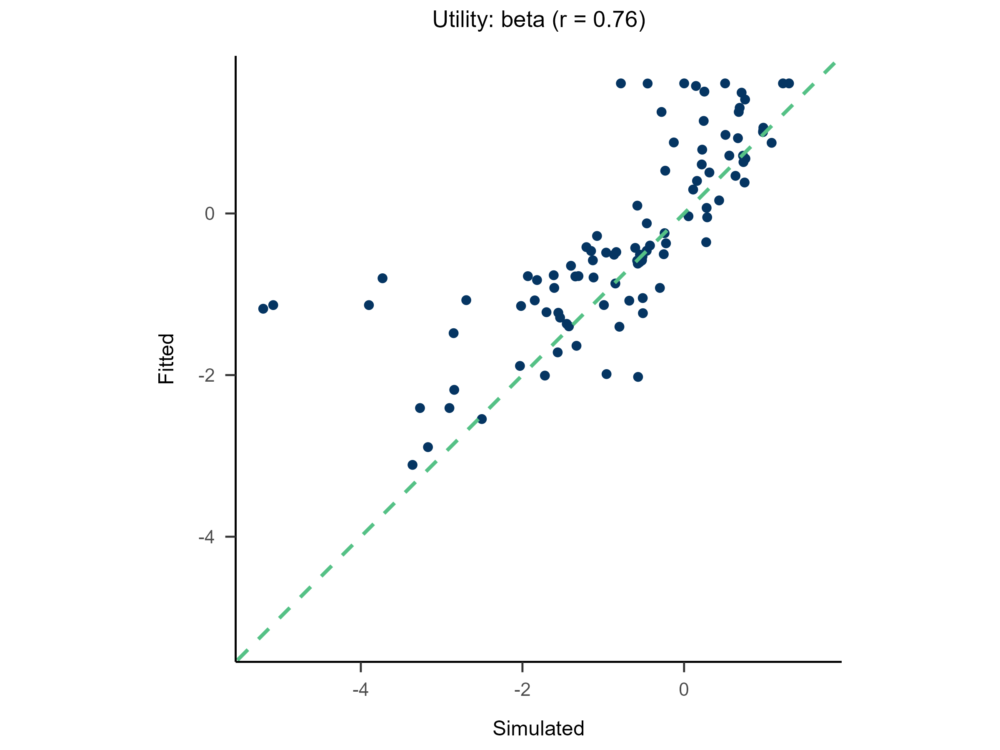

## 0. Data Structure

| Subject | Block | Trial | L_choice | R_choice | L_reward | R_reward | Sub_Choose | - |
|---------|-------|-------|----------|----------|----------|----------|------------|---|
| 1       | 1     | 1     | A        | B        | 36       | 40       | A          |...|
| 1       | 1     | 2     | B        | A        | 0        | 36       | B          |...|
| 1       | 1     | 3     | C        | D        | -36      |-40       | C          |...|
| 1       | 1     | 4     | D        | C        | 0        |-36       | D          |...|
| ...     | ...   | ...   | ...      | ...      | ...      | ...      | ...        |...|

```{r}
data = multiRL::TAB
colnames = list(
  subid = "Subject", block = "Block", trial = "Trial",
  object = c("L_choice", "R_choice"), 
  reward = c("L_reward", "R_reward"),
  action = "Sub_Choose",
  exinfo = c("...", "...", "...")
)
behrule = list(
  cue = c("A", "B", "C", "D"),
  rsp = c("A", "B", "C", "D")
)
```

**Note**  

1. The number of `object` and `reward` can be multiple (> 2), but they must have a strict one-to-one correspondence.  
2. An object can consist of multiple elements; please separate them with "_" (e.g., 'context_target_behavior').  
3. An action can point to either an entire object or a specific part of it. For details, see [this](https://yuki-961004.github.io/multiRL/reference/behrule.html)  
4. Any additional information (column names) should be passed to `exinfo` as a character vector.  

<!---------------------------------------------------------->

## 1. Run Model {#1-run-model}

Create a function with **ONLY ONE** argument, `params`

```{r eval=FALSE}
Model <- function(params){
  
############################# [Modify Here] ####################################
  params <- list(free = list(alpha = params[1], beta = params[2]))
############################# [Modify Here] ####################################

  multiRL.model <- multiRL::run_m(
    data = data,
    behrule = behrule,
    colnames = colnames,
    params = params,
    funcs = funcs,
    priors = priors,
    settings = settings
  )
  
  assign(x = "multiRL.model", value = multiRL.model, envir = multiRL.env)
  return(.return_result(multiRL.model))
}
```

<!---------------------------------------------------------->

### How to define a new model?

<!---------------------------------------------------------->

1. Customize the following six core functions.  
2. Figure out the free parameters within your model.
3. Declare these parameters as free when defining the object function above.

<!---------------------------------------------------------->

<details>
<summary>Learning Rate (α)</summary>

```{r eval=FALSE}
print(multiRL::func_alpha)
```

```{r eval=FALSE}
func_alpha <- function(
    qvalue,
    reward,
    params,
    system,
    ...
){
  
  list2env(list(...), envir = environment())
  
  # If you need extra information(...)
  # Column names may be lost(C++), indexes are recommended
  # e.g.
  # Trial  <- idinfo[3]
  # Frame  <- exinfo[1]
  # Action <- behave[1]
  
  alpha     <-  params[["alpha"]]
  alphaN    <-  params[["alphaN"]]
  alphaP    <-  params[["alphaP"]]
  
  # Determine the model currently in use based on which parameters are free.
  if (
    system == "RL" && !(is.null(alpha)) && is.null(alphaN) && is.null(alphaP)
  ) {
    model <- "TD"
  } else if (
    system == "RL" && is.null(alpha) && !(is.null(alphaN)) && !(is.null(alphaP))
  ) {
    model <- "RSTD"
  } else if (
    system == "WM"
  ) {
    model <- "WM"
    alpha <- 1
  } else {
    stop("Unknown Model! Plase modify your learning rate function")
  }

  # TD
  if (model == "TD") {
    update <- qvalue + alpha  * (reward - qvalue)
  # RSTD
  } else if (model == "RSTD" && reward < qvalue) {
    update <- qvalue + alphaN * (reward - qvalue)
  } else if (model == "RSTD" && reward >= qvalue) {
    update <- qvalue + alphaP * (reward - qvalue)
  # WM
  } else if (model == "WM") {
    update <- qvalue + alpha  * (reward - qvalue)
  }

  return(update)
}
```
</details>

<!---------------------------------------------------------->

<details>
<summary>Soft-Max (β)</summary>

```{r eval=FALSE}
print(multiRL::func_beta)
```

```{r eval=FALSE}
func_beta <- function(
    qvalue, 
    explor,
    params,
    system,
    ...
){
  
  list2env(list(...), envir = environment())
  
  # If you need extra information(...)
  # Column names may be lost(C++), indexes are recommended
  # e.g.
  # Trial  <- idinfo[3]
  # Frame  <- exinfo[1]
  # Action <- behave[1]
  
  beta     <- params[["beta"]]
  lapse    <- params[["lapse"]]
  weight   <- params[["weight"]]
  capacity <- params[["capacity"]]
  sticky   <- params[["sticky"]]

  index     <- which(!is.na(qvalue[[1]]))
  n_shown   <- length(index)
  n_system  <- length(qvalue)
  n_options <- length(qvalue[[1]])
  
  # Assign weights to different systems
  if (length(weight) == 1L) {weight <- c(weight, 1 - weight)}
  weight <- weight / sum(weight)
  if (n_system == 1) {weight <- weight[1]}
  
  # Compute the probabilities estimated by different systems
  prob_mat <- matrix(0, nrow = n_options, ncol = n_system)
  
  if (explor == 1) {
    prob_mat[index, ] <- 1 / n_shown
  } else {
    for (s in seq_len(n_system)) {
      sub_qvalue <- qvalue[[s]]
      exp_stable <- exp(beta * (sub_qvalue - max(sub_qvalue, na.rm = TRUE)))
      prob_mat[, s] <- exp_stable / sum(exp_stable, na.rm = TRUE)
    }
  }
  
  # Weighted average
  prob <- as.vector(prob_mat %*% weight)
  
  # lapse
  prob <- (1 - lapse * n_shown) * prob + lapse
  
  return(prob)
}
```

</details>

<!---------------------------------------------------------->

<details>
<summary>Utility Function (γ)</summary>

```{r eval=FALSE}
print(multiRL::func_gamma)
```

```{r eval=FALSE}
func_gamma <- function(
    reward,
    params,
    ...
){
  
  list2env(list(...), envir = environment())
  
  # If you need extra information(...)
  # Column names may be lost(C++), indexes are recommended
  # e.g.
  # Trial  <- idinfo[3]
  # Frame  <- exinfo[1]
  # Action <- behave[1]

  gamma     <-  params[["gamma"]]

  # Stevens' Power Law
  utility <- sign(reward) * (abs(reward) ^ gamma)
  
  return(utility)
}
```
</details>

<!---------------------------------------------------------->

<details>
<summary>Upper-Confidence-Bound (δ)</summary>

```{r eval=FALSE}
print(multiRL::func_delta)
```

```{r eval=FALSE}
func_delta <- function(
    count,
    params,
    ...
){
  
  list2env(list(...), envir = environment())
  
  # If you need extra information(...)
  # Column names may be lost(C++), indexes are recommended
  # e.g.
  # Trial  <- idinfo[3]
  # Frame  <- exinfo[1]
  # Action <- behave[1]
  
  delta     <-  params[["delta"]]

  bias <- delta * sqrt(log(count + exp(1)) / (count + 1e-10))
  
  return(bias)
}
```
</details>

<!---------------------------------------------------------->

<details>
<summary>Epsilon Related (ε)</summary>

```{r eval=FALSE}
print(multiRL::func_epsilon)
```

```{r eval=FALSE}
func_epsilon <- function(
    rownum,
    params,
    ...
){
  
  list2env(list(...), envir = environment())
  
  # If you need extra information(...)
  # Column names may be lost(C++), indexes are recommended
  # e.g.
  # Trial  <- idinfo[3]
  # Frame  <- exinfo[1]
  # Action <- behave[1]
  
  epsilon   <-  params[["epsilon"]]
  threshold <-  params[["threshold"]]
  
  # Determine the model currently in use based on which parameters are free.
  if (is.na(epsilon) && threshold > 0) {
    model <- "first"
  } else if (!(is.na(epsilon)) && threshold == 0) {
    model <- "decreasing"
  } else if (!(is.na(epsilon)) && threshold == 1) {
    model <- "greedy"
  } else {
    stop("Unknown Model! Plase modify your learning rate function")
  }
  
  set.seed(rownum)
  # Epsilon-First: 
  if (rownum <= threshold) {
    try <- 1
  } else if (rownum > threshold && model == "first") {
    try <- 0
  # Epsilon-Greedy:
  } else if (rownum > threshold && model == "greedy"){
    try <- sample(
      c(1, 0),
      prob = c(epsilon, 1 - epsilon),
      size = 1
    )
  # Epsilon-Decreasing: 
  } else if (rownum > threshold && model == "decreasing") {
    try <- sample(
      c(1, 0),
      prob = c(
        1 / (1 + epsilon * rownum),
        epsilon * rownum / (1 + epsilon * rownum)
      ),
      size = 1
    )
  }
  
  return(try)
}
```
</details>

<!---------------------------------------------------------->

<details>
<summary>Working Memory (ζ)</summary>
```{r eval=FALSE}
print(multiRL::func_zeta)
```

```{r eval=FALSE}
func_zeta <- function(
    value0, 
    values,
    reward,
    params,
    system,
    ...
){
  
  list2env(list(...), envir = environment())
  
  # If you need extra information(...)
  # Column names may be lost(C++), indexes are recommended
  # e.g.
  # Trial  <- idinfo[3]
  # Frame  <- exinfo[1]
  # Action <- behave[1]
  
  zeta       <-  params[["zeta"]]
  bonus      <-  params[["bonus"]]
  
  if (reward == 0) {
    decay <- values + zeta * (value0 - values)
  } else if (reward < 0) {
    decay <- values + zeta * (value0 - values) + bonus
  } else if (reward > 0) {
    decay <- values + zeta * (value0 - values) - bonus
  }

  return(decay)
}
```
</details>

<!---------------------------------------------------------->

## 2. Recovery {#2-recovery}

Randomly generate free parameters for Model A and use them to produce simulated data. Subsequently, fit all candidate models to this simulated data. This step involves parameter recovery and model recovery for each candidate model. If a model meets the following two criteria, it can be considered robust and suitable for fitting real data and for model comparison.   

> 1. If Model A can successfully recover its true generative parameters from the simulated data, it indicates strong parameter recovery for the model.  
> 2. If Model A yields the best fit indices compared to all other candidate models when fitted to the data it generated, it demonstrates robust model recovery.

**Note**  

if a researcher skips this step and directly fits the candidate models to real data and conducts model comparison, then when one model emerges as the winner, it is impossible to determine whether this is because the model is genuinely superior or because the other models are not robust at all and thus are not even qualified to be included in a model comparison.

<!---------------------------------------------------------->

```{r eval=FALSE}
recovery.MLE <- multiRL::rcv_d(
  estimate = "MLE",

  data = data,
  colnames = colnames,
  behrule = behrule,

  models = list(multiRL::TD, multiRL::RSTD, multiRL::Utility),
  priors = list(
    list(
      alpha = function(x) {stats::rbeta(n = 1, shape1 = 2, shape2 = 2)}, 
      beta = function(x) {stats::rexp(n = 1, rate = 1)}
    ),
    list(
      alphaN = function(x) {stats::rbeta(n = 1, shape1 = 2, shape2 = 2)}, 
      alphaP = function(x) {stats::rbeta(n = 1, shape1 = 2, shape2 = 2)}, 
      beta = function(x) {stats::rexp(n = 1, rate = 1)}
    ),
    list(
      alpha = function(x) {stats::rbeta(n = 1, shape1 = 2, shape2 = 2)}, 
      beta = function(x) {stats::rexp(n = 1, rate = 1)},
      gamma = function(x) {stats::rbeta(n = 1, shape1 = 2, shape2 = 2)}
    )
  ),
  settings = list(name = c("TD", "RSTD", "Utility")),
  
  algorithm = "NLOPT_GN_MLSL",
  lowers = list(c(0, 0), c(0, 0, 0), c(0, 0, 0)),
  uppers = list(c(1, 5), c(1, 1, 5), c(1, 5, 1)),
  control = list(core = 10, sample = 100, iter = 100)
)
```

<pre>
Recovery TD

Simulating...

Fitting TD
  |==================                                                           | 25%
</pre>


<!---------------------------------------------------------->

## 3. Fit Real Data {#3-fit-real-data}

A model that achieves good parameter recovery in Step 2 indicates that it has reliability. A model that achieves good model recovery in Step 2 indicates that it is distinguishable from other models.

Only models that possess both reliability and distinguishability should be used to fit real data. The optimal model is then determined based on how similar the experimental effects reproduced by the model are to those observed in human participants.

```{r eval=FALSE}
fitting.MLE <- multiRL::fit_p(
  estimate = "MLE",

  data = data,
  colnames = colnames,
  behrule = behrule,

  models = list(multiRL::TD, multiRL::RSTD, multiRL::Utility),
  settings = list(name = c("TD", "RSTD", "Utility")),
  
  algorithm = "NLOPT_GN_MLSL",
  lowers = list(c(0, 0), c(0, 0, 0), c(0, 0, 0)),
  uppers = list(c(1, 5), c(1, 1, 5), c(1, 5, 1)),
  control = list(core = 10, iter = 100)
)
```  

<pre>
Fitting TD
  |==================                                                           | 25%
</pre>

<!---------------------------------------------------------->

## 4. Replay the Experiment {#4-replay-the-experiment}

The results from recovery(`rcv_d`) and fitting(`fit_p`) can be passed to the `rpl_e` function to reproduce the behavioral patterns generated by re-incorporating these parameters into the model.  

```{r eval=FALSE}
replay.recovery <- multiRL::rpl_e(
  result = recovery.MLE,

  data = data,
  colnames = colnames,
  behrule = behrule,
  
  models = list(multiRL::TD, multiRL::RSTD, multiRL::Utility),
  settings = list(name = c("TD", "RSTD", "Utility")),

  omit = c("data", "funcs")
)
  
plot(x = replay.recovery)
```

<p align="center">
    
    
</p>

<p align="center">
    
    
    
</p>

<p align="center">
    
    
    
</p>

```{r eval=FALSE}
replay.fitting <- multiRL::rpl_e(
  result = fitting.MLE,

  data = data,
  colnames = colnames,
  behrule = behrule,
  
  models = list(multiRL::TD, multiRL::RSTD, multiRL::Utility),
  settings = list(name = c("TD", "RSTD", "Utility")),
  
  omit = c("funcs")
)

plot(x = replay.fitting)
```

<p align="center">
    
</p>